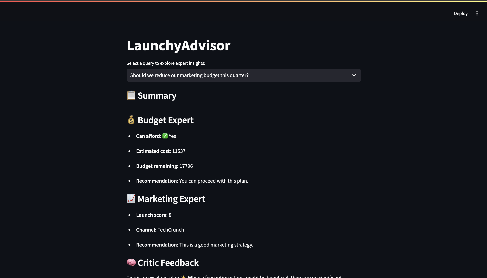

# 🚀 LaunchyAdvisor

## Overview

**LaunchyAdvisor** is a multi-agent system designed to evaluate the feasibility of launching an AI product in a specific region. The system includes:

- 🧠 **Expert Agents**:
  - `BudgetExpert`: Checks financial viability.
  - `LegalExpert`: Evaluates legal compliance.
  - `MarketingExpert`: Analyzes go-to-market strategy.
- 🧠 **CriticAgent**: Reviews and suggests improvements to the overall launch plan.
- 🧠 **OrchestratorAgent**: Routes queries to experts, aggregates responses, and synthesizes a final decision.
- 📊 **Streamlit Dashboard**: An interactive UI to query the system and display results.

---

## 🧠 Architecture

- Each expert agent is modular and operates independently.
- The `orchestrator.py` file handles:
  - Query decomposition
  - Expert invocation
  - Response synthesis
- The `streamlit_app.py` script launches a dashboard UI for easy interaction.


---

## ⚙️ How to Run

### Step 1: Clone the repository

Use this command to clone this repository:

```bash
git clone https://github.com/Lavanya511/LaunchyAdvisor.git
```

### Step 2: Install Streamlit

Make sure you have Python installed. Then run:

```bash
pip install streamlit
pip3 install steamlit
```
### Step 3: Run Streamlit

Run:

```bash
streamlit run dashboard.py

```

---  


## 📸 Dashboard UI

Here’s how the Streamlit dashboard looks:

